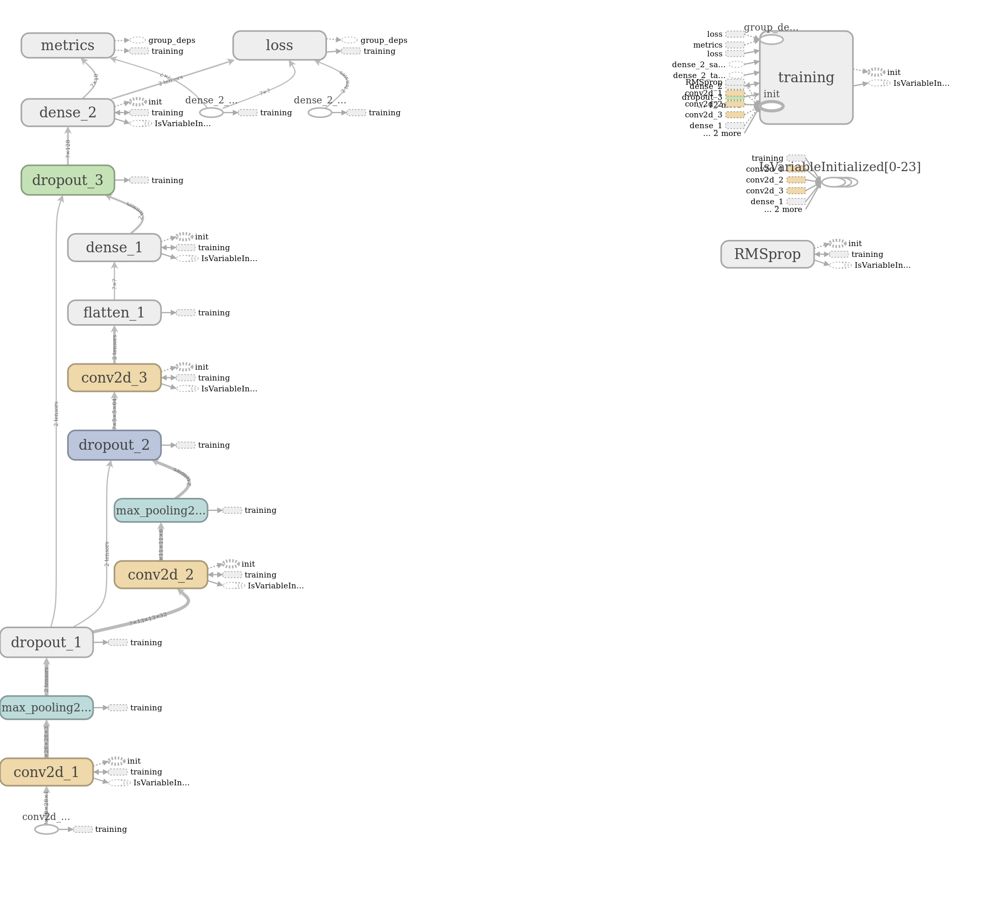
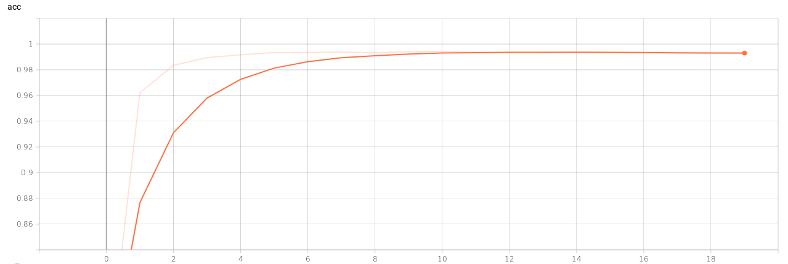

# CNN to detect digits for the PREN project @ HSLU

This repository contains notebooks, assets and a pre-trained model for a
Convolutional Neural Network intended to predict digits from 28x28 images.

This CNN was used in the PREN project @ HSLU.

The repository consists of 3 parts:

* A jupyter notebook to augment and multiply the test images in the `images/` folder
* A jupyter notebook to train a CNN using the augmented test images
* A pre-trained model in `models/`

The CNN classifies the numbers *1-9* and *0* for *not-a-number*.

See the jupyter notebooks for more details about the image augmentation and model architecture, training and evaluation.

Graph:

Accuracy during training:

***

*
This project is published under [MIT](LICENSE). A [Timo Furrer](https://tuxtimo.me) project. - :tada: -
*
